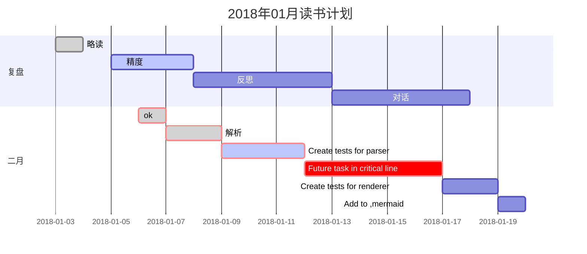

---
export_on_save:
  markdown: true
---

```mermaid
gantt
  dateFormat　YYYY-MM-DD
  title 2018年01月读书计划

  section 复盘
　略读　　   :done, des1, 2018-01-03,2018-01-04
　精度 　　　　   :active, des2, 2018-01-05, 3d
　反思 　　　　  :　　　  des3, after des2, 5d
　对话         :　　　  des4, after des3, 5d

　section 二月
　ok　:crit, done,d3, 2018-01-06,24h
　解析　　　　　　:crit, done, after d3, 2d
　　　Create tests for parser　　　　　　　:crit, active, 3d
　　　Future task in critical line　　　　　:crit, 5d
　　　Create tests for renderer　　　　　　:2d
　　　Add to ,mermaid　　　　　　　　　　　:1d
```
