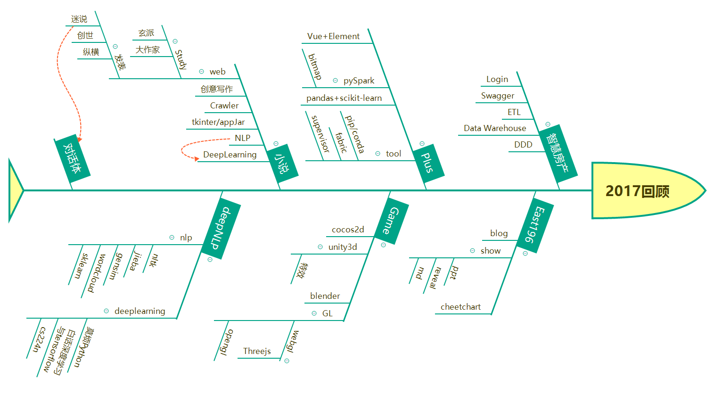

# 2017 复盘

## 技术方向

### 前半年

精力主要放在公司项目/企业应用方面

### 后半年

- 6、7月： 可视化和游戏
- 8月：重新思考前进方向
- 9月： 创意写作
- 10月： 小说生成器编写
- 11、12月：由于NLP上的一些问题，入坑DeepLearning

总的来说9月以后的方向是明确的，但是有扩大化的趋势。

先集中精力出一个最小可用产品才是王道。

## 反思

小说生成器的方向是正确的。

但是如果出普通版本早就应该出了，为什么？

架构方面不太兼容是一方面，想一劳永逸也是一方面。

## Reference

复盘
