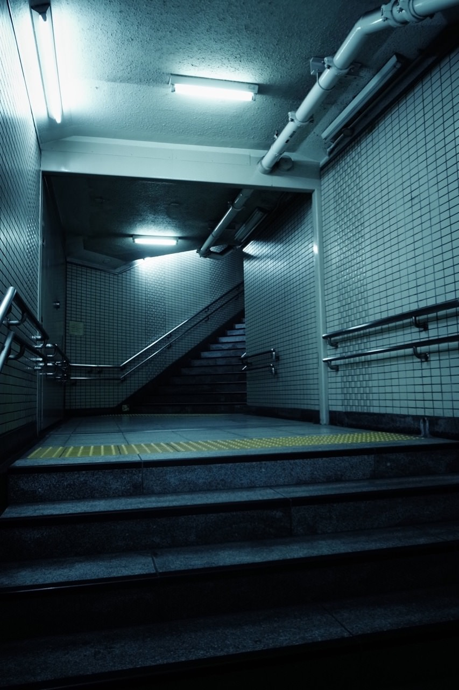

# 构建地铁项目

## 教学视频 英文
[bilibili](https://www.bilibili.com/video/av18637496/)

## 材料
### [BLAM](https://github.com/stuffmatic/blam) 设定摄像机角度

[User's guide](https://github.com/stuffmatic/blam/wiki/User%27s-guide)

[blender blam](http://v.youku.com/v_show/id_XNDQwNTkzMjUy.html)

this tutorial shows how to use blam to set the focal length and orientation of the active camera and how to reconstruct 3d geomery from an image.

first,open the image in the UV/image editer.

then create two grease pencil layers,each contains at least two line segment strokes (ctrl+d+left mouse button)

these line segments correspond to lines in 3d space and must fulfill two conditions:
1. all 3d lines represented by line segments in the same layer must be parallel.
2. all 3d lines represented by line segments in one layer must be perpendicular to lines represented by segments in the other.

 begin by drawing lines parallel to the x axis.

 then draw lines parallel to the y axis (which is perpendicular to the x axis)

 assign an axis to each grease pencil layer and compute the focal length and orientation for the active camera.

 set the image as the 3d view background and move the camera to make origin coincide with a corner in the image.

[Blender Turn a 2D photograph into a 3D animation with Blam](http://v.youku.com/v_show/id_XODk5MTc4MDQ0.html)

### blam不好用，camera-calibration-pvr才是王道
https://github.com/mrossini-ethz/camera-calibration-pvr

###
[subway picture](https://imgur.com/a/27TwB)

### [poliigon:Make better 3D renders](https://www.poliigon.com/)

一般勾选一个就OK了

### http://cgterminal.com/2018/01/17/blender-subway-corridor-20-minutes/

BLAM Addon: github.com/stuffmatic/blam
Filmic Tutorial: youtube.com/watch?v=m9AT7H4GGrA
18 Ways to Speed up Cycles Rendering: youtube.com/watch?v=8gSyEpt4-60
Pure Ref: pureref.com
Tiles 27: poliigon.com/texture/1669
Tactile Bumpy Pavement: poliigon.com/texture/2575
Floor Smudges: poliigon.com/texture/2387
Grunge Wall Leak: poliigon.com/texture/2696
Hand Smudges: poliigon.com/texture/2384
Brush: Droplet Residue: poliigon.com/texture/1596
Brush: Mossy Overlay: poliigon.com/texture/2748
Reference Image: imgur.com/a/27TwB
Motion Squared Cinema 4D Bundles: goo.gl/ejWjRc

## 车道

[1](https://www.blenderguru.com/tutorials/create-an-underground-subway-scene)
[2](https://www.blendernation.com/headers/subway-station-matrix-inspired/)
