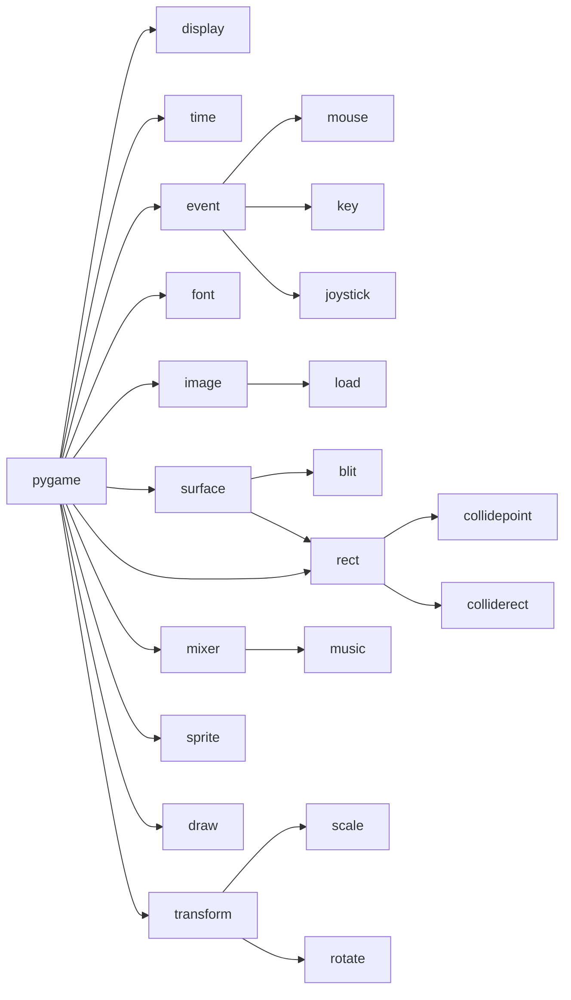

# pygame
pygame是python界老牌的游戏框架。

```mermaid
graph LR;  
  pygame --> display;  
  pygame --> time;  
  pygame --> event;  
  event --> mouse;  
  event --> key;  
  event --> joystick;  
  pygame --> font;  
  pygame--> image;  
  pygame--> surface;  
  image--> load;
  surface--> blit;
  pygame --> mixer;
  pygame --> rect;
  rect --> collidepoint;
  rect --> colliderect;
  surface --> rect;
  mixer --> music;
  pygame--> transform;
  transform--> scale;
  transform--> rotate;
  pygame--> sprite;  
  pygame--> draw;  
```

## 如何记忆API？
