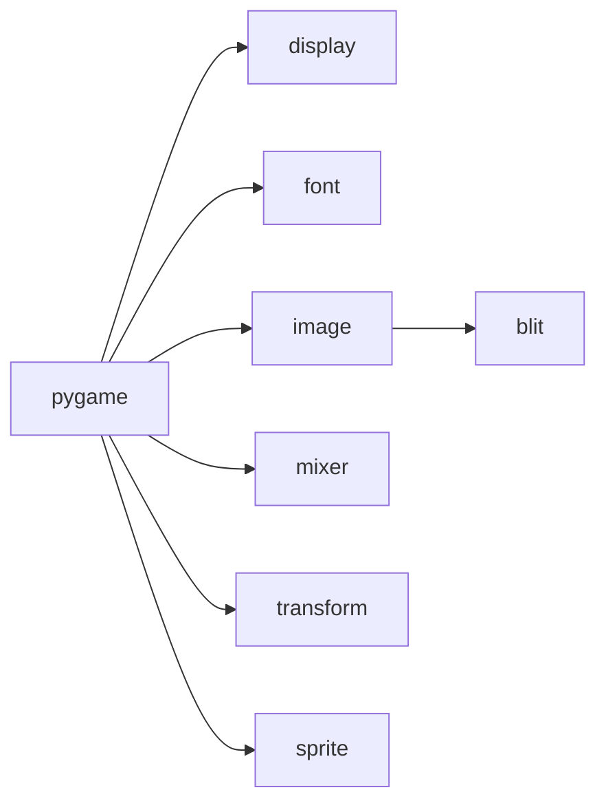

# pygame
pygame是python界老牌的游戏框架。

```mermaid
graph LR;  
  pygame --> display;  
  pygame --> font;  
  pygame--> image;  
  image--> blit;
  pygame --> mixer;
  pygame--> transform;
  pygame--> sprite;  
```

## 如何记忆API？
