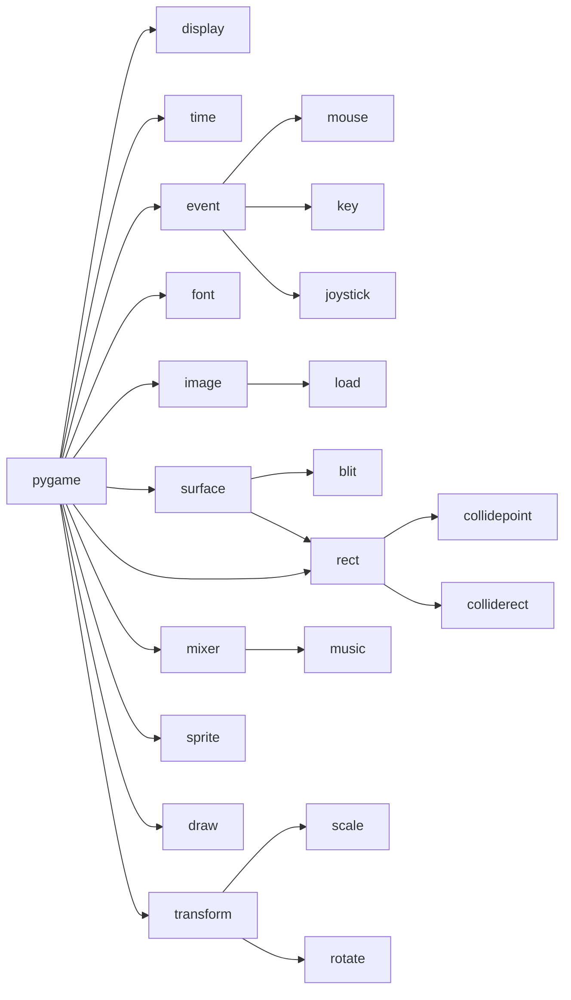

# pygame
pygame是python界老牌的游戏框架。



## 如何记忆API？

## 教程
http://www.cs.iupui.edu/~aharris/pygame/

### pygame 事件说明
```text
  事件                    产生途径                参数
  QUIT                  用户按下关闭按钮                 none
  ATIVEEVENT            Pygame被激活或者隐藏             gain, state
  KEYDOWN               键盘被按下                      unicode, key, mod
  KEYUP                 键盘被放开                      key, mod
  MOUSEMOTION           鼠标移动                        pos, rel, buttons
  MOUSEBUTTONDOWN       鼠标按下                        pos, button
  MOUSEBUTTONUP         鼠标放开                        pos, button
  JOYAXISMOTION         游戏手柄(Joystick or pad)移动    joy, axis, value
  JOYBALLMOTION         游戏球(Joy ball)?移动            joy, axis, value
  JOYHATMOTION          游戏手柄(Joystick)?移动           joy, axis, value
  JOYBUTTONDOWN         游戏手柄按下                      joy, button
  JOYBUTTONUP           游戏手柄放开                      joy, button
  VIDEORESIZE           Pygame窗口缩放                   size, w, h
  VIDEOEXPOSE           Pygame窗口部分公开(expose)        none
  USEREVENT             触发了一个用户事件                code
```

游戏编程十年总结
