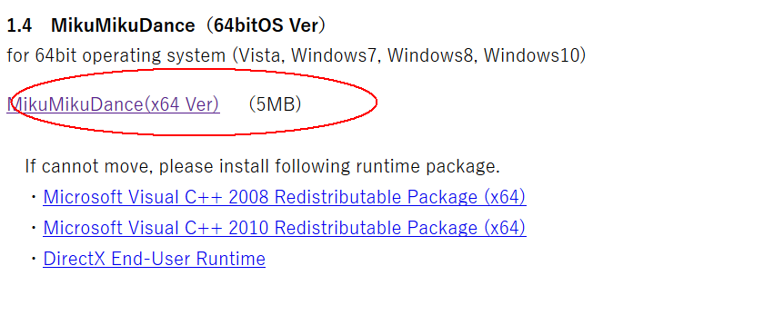

# blender
https://docs.blender.org/manual/en/dev/
## 新闻

[blendernation](https://www.blendernation.com)

## install

## mmd
参考:https://www.bilibili.com/video/av6642693

### 解压mmd_tools文件夹到 scripts/addons下
[blender mmd tool](https://github.com/sugiany/blender_mmd_tools)

### 下载mmd
[mmd](http://www.geocities.jp/higuchuu4/)

### 下载动作文件
[yurie](http://ux.getuploader.com/yurie)

下载极乐净土 密码1219

进入blender
import mmd ，convert ，build，import vmd
渲染+音频

渲染动画直接渲染就好
渲染图片需要 另存为图像。不要奇怪，他是不会自动保存的！！！
