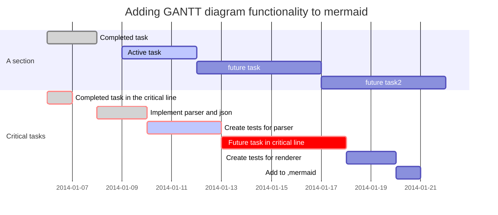

<!-- ---
export_on_save:
  markdown: true
--- -->

# [markdown-preview-enhanced](<https://github.com/shd101wyy/markdown-preview-enhanced>)

强大的markdown插件

可用于atom和vscode


## 文字

$ y=sin(x)/S^2 $

<https://khan.github.io/KaTeX/function-support.html>

```python {cmd=true}

# coding:utf-8
print "ab"

````
```python {cmd=true matplotlib=true}
import matplotlib.pyplot as plt
plt.plot([1,2,3, 4])
plt.show() # show figure
````

```javascript {cmd="node"} const date = Date.now() console.log(date.toString())

````

### ditaa文字变图片
```ditaa {cmd=true args=["-E"]}
+--------+   +-------+    +-------+
|        | --+ ditaa +--> |       |
|  Text  |   +-------+    |diagram|
|Document|   |!magic!|    |       |
|     {d}|   |       |    |       |
+---+----+   +-------+    +-------+
    :                         ^
    |       Lots of work      |
    +-------------------------+
````
## 甘特图



## 手写序列图，中文并没有手写...

```sequence { theme = "hand"}
Title: Here is a title
A->B: Normal line
B-->C: Dashed line
C->>D: Open arrow
D-->>A: Dashed open arrow
````
### plantuml

```puml
Class01 <|-- Class02
Class03 *-- Class04
Class05 o-- Class06
Class07 .. Class08
Class09 -- Class10
````

use class uml,if show error!

please set graphviz

> 要重启

GRAPHVIZ_INSTALL_DIR=/ GRAPHVIZ_DOT=/bin/dot.exe path + /bin setx是永久，set是临时

```
setx GRAPHVIZ_INSTALL_DIR "D:\software\graphviz-2.38\release\"  
setx GRAPHVIZ_DOT "D:\software\graphviz-2.38\release\bin\dot.exe"
```

## 安装成功
```puml
testdot
```

`java -jar plantuml.jar -testdot`

> 可选 pip install graphviz
